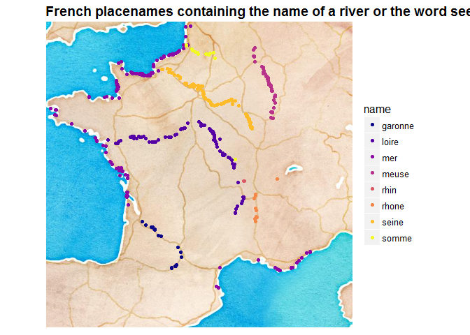
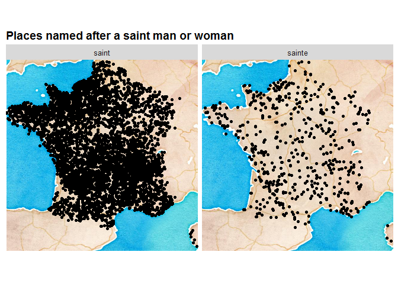

Analysis of names of French villages
====================================

Inspired by [this work about names of villages in Germany](https://github.com/hrbrmstr/zellingenach), I wanted to had a look at the names of French villages. I decided against looking at prefixes and suffixes at least for now. Instead, I have chosen to visualize two particular aspects of names of villages and towns in France (only the mainland).

I got a file of all French villages names and geolocation from [Geonames](http://download.geonames.org/), which you can find in the [data folder](data/). Thanks to Bob for providing me with [the link](https://gist.github.com/hrbrmstr/0fd37cf3825fc8e3eddf042a4443d1dc). The data is distributed under [this license](http://creativecommons.org/licenses/by/3.0/).

A first look at the data
========================

``` r
library("dplyr")
library("tidyr")
library("readr")
ville <- read_tsv("data/FR.txt", col_names = FALSE)[, 1:6]
knitr::kable(head(ville))
```

|       X1| X2                    | X3                    | X4                                                          |        X5|       X6|
|--------:|:----------------------|:----------------------|:------------------------------------------------------------|---------:|--------:|
|  2659086| Recon, Col de         | Recon, Col de         | Rapenaz Col de,Recon Col de                                 |  46.30352|  6.82838|
|  2659815| Lucelle               | Lucelle               | La Lucelle Riviere,La Lucelle Rivière,Lucelle,Lutzel,Lützel |  47.41667|  7.50000|
|  2659933| Les Cornettes de Bise | Les Cornettes de Bise | Cornettes de Bise,Les Cornettes de Bise                     |  46.33333|  6.78333|
|  2659943| Ruisseau le Lertzbach | Ruisseau le Lertzbach | Le Lertzbach Ruisseau,Lertzbach,Ruisseau le Lertzbach       |  47.58333|  7.58333|
|  2659973| Le Cheval Blanc       | Le Cheval Blanc       | Le Cheval Blanc                                             |  46.05132|  6.87178|
|  2660216| Jougnena              | Jougnena              | Jougnena,Jougnenaz,Jouguena,La Jougnena Ruisseau            |  46.71667|  6.40000|

Names of rivers
===============

Here I select names of towns and villages that include the names of a few rivers in France, or the word "see" ("sur-Mer"). This is by no mean an exhaustive representation of such names since I only chose a few rivers and a pattern of name.

``` r
water <- ville %>%
  mutate(mer = grepl("sur-Mer", X2))  %>%
  mutate(rhone = grepl("sur-Rhône", X2))  %>%
  mutate(somme = grepl("sur-Somme", X2))  %>%
  mutate(loire = grepl("sur-Loire", X2)) %>%
  mutate(seine = grepl("sur-Seine", X2)) %>%
  mutate(rhin = grepl("sur-Rhin", X2)) %>%
  mutate(garonne = grepl("sur-Garonne", X2)) %>%
  mutate(meuse = grepl("sur-Meuse", X2)) %>%
  gather("name", "yes", mer:meuse) %>%
  filter(yes == TRUE) %>%
  select(- yes)
knitr::kable(head(water))
```

|       X1| X2                   | X3                   | X4                                                                                                                                                                                                                                                                                                                                                                                                                                                                                                                                                                                                                                                                                                                                                                                                          |        X5|        X6| name |
|--------:|:---------------------|:---------------------|:------------------------------------------------------------------------------------------------------------------------------------------------------------------------------------------------------------------------------------------------------------------------------------------------------------------------------------------------------------------------------------------------------------------------------------------------------------------------------------------------------------------------------------------------------------------------------------------------------------------------------------------------------------------------------------------------------------------------------------------------------------------------------------------------------------|---------:|---------:|:-----|
|  2968325| Villers-sur-Mer      | Villers-sur-Mer      | Ville-sjur-Mer,Viller-sjur-Mer,Villers,Villers-sur-Mer,bin hai wei lai er,<U+0412><U+0438><U+043B><U+043B><U+0435>-<U+0441><U+044E><U+0440>-<U+041C><U+0435><U+0440>,<U+0412><U+0438><U+043B><U+043B><U+0435><U+0440>-<U+0441><U+044E><U+0440>-<U+041C><U+0435><U+0440>,<U+0412><U+0456><U+043B><U+043B><U+0435>-<U+0441><U+044E><U+0440>-<U+041C><U+0435><U+0440>,<U+6EE8><U+6D77><U+7EF4><U+83B1><U+5C14>                                                                                                                                                                                                                                                                                                                                                                                                 |  49.32264|   0.00027| mer  |
|  2968749| Villefranche-sur-Mer | Villefranche-sur-Mer | Vil'fransh-sjur-Mer,Vilafranca de Mar,Villa Franca Niciensium,Villafranca,Villefranche,Villefranche-sur-Mer,bilpeulangsyuswileumeleu,bin hai zi you cheng,fylfransh swr myr,vu~irufuranshu=shuru=meru,<U+0412><U+0438><U+043B><U+044C><U+0444><U+0440><U+0430><U+043D><U+0448>-<U+0441><U+044E><U+0440>-<U+041C><U+0435><U+0440>,<U+0412><U+0456><U+043B><U+044C><U+0444><U+0440><U+0430><U+043D><U+0448>-<U+0441><U+044E><U+0440>-<U+041C><U+0435><U+0440>,<U+0641><U+064A><U+0644><U+0641><U+0631><U+0627><U+0646><U+0634> <U+0633><U+0648><U+0631> <U+0645><U+064A><U+0631>,<U+30F4><U+30A3><U+30EB><U+30D5><U+30E9><U+30F3><U+30B7><U+30E5>=<U+30B7><U+30E5><U+30EB>=<U+30E1><U+30FC><U+30EB>,<U+6EE8><U+6D77><U+81EA><U+7531><U+57CE>,<U+BE4C><U+D504><U+B791><U+C288><U+C26C><U+B974><U+BA54><U+B974> |  43.70470|   7.30776| mer  |
|  2969258| Vierville-sur-Mer    | Vierville-sur-Mer    | Vierville,Vierville-sur-Mer                                                                                                                                                                                                                                                                                                                                                                                                                                                                                                                                                                                                                                                                                                                                                                                 |  49.37237|  -0.90709| mer  |
|  2969534| Veulettes-sur-Mer    | Veulettes-sur-Mer    | Velett-sjur-Mer,Veulettes,Veulettes-sur-Mer,<U+0412><U+0435><U+043B><U+0435><U+0442><U+0442>-<U+0441><U+044E><U+0440>-<U+041C><U+0435><U+0440>                                                                                                                                                                                                                                                                                                                                                                                                                                                                                                                                                                                                                                                              |  49.85162|   0.59719| mer  |
|  2969657| Ver-sur-Mer          | Ver-sur-Mer          | Ver,Ver-sjur-Mer,Ver-sur-Mer,bin hai wei,wyr swr mrsy,<U+0412><U+0435><U+0440>-<U+0441><U+044E><U+0440>-<U+041C><U+0435><U+0440>,<U+0648><U+0626><U+0631> <U+0633><U+0648><U+0631> <U+0645><U+0631><U+0633><U+06CC>,<U+6EE8><U+6D77><U+97E6>                                                                                                                                                                                                                                                                                                                                                                                                                                                                                                                                                                |  49.32987|  -0.53118| mer  |
|  2970317| Vaux-sur-Mer         | Vaux-sur-Mer         | Vaux,Vaux-sur-Mer,Vo syur Mer,Vo-sjur-Mer,bin hai wo,wawks swr mrsy,<U+0412><U+043E>-<U+0441><U+044E><U+0440>-<U+041C><U+0435><U+0440>,<U+054E><U+0578> <U+057D><U+0575><U+0578><U+0582><U+0580> <U+0544><U+0565><U+0580>,<U+0648><U+0627><U+0648><U+06A9><U+0633> <U+0633><U+0648><U+0631> <U+0645><U+0631><U+0633><U+06CC>,<U+6EE8><U+6D77><U+6C83>                                                                                                                                                                                                                                                                                                                                                                                                                                                       |  45.64606|  -1.05841| mer  |

Here is the result on a map.

``` r
library("ggplot2")
library("ggmap")
library("viridis")
map <- ggmap::get_map(location = "France", zoom = 6, maptype = "watercolor")
```

``` r
library("ggplot2")
library("ggmap")
library("viridis")
ggmap(map) +
  geom_point(data = water,
             aes(x = X6, y = X5, col = name)) +
  scale_color_viridis(discrete = TRUE, option = "plasma")+
  theme(axis.line=element_blank(),axis.text.x=element_blank(),
        axis.text.y=element_blank(),axis.ticks=element_blank(),
        axis.title.x=element_blank(),
        text = element_text(size=12),
        axis.title.y=element_blank(),
        panel.background=element_blank(),panel.border=element_blank(),panel.grid.major=element_blank(),
        panel.grid.minor=element_blank(),plot.background=element_blank())+
  ggtitle("French placenames containing the name of a river or the word see") +
  theme(plot.title = element_text(lineheight=1, face="bold"))
```

<!-- -->

It is a nice lesson in geography for me.

Saint et Saintes
================

In French, towns such as "Saint-Ouen" and "Sainte-Anne" can easily be partitioned into *cities named after a saint man* (saint) and *cities named after a saint woman* (sainte). Thinking of this prompted me to have a look at the distribution of such place names.

``` r
saints <- ville %>%
  mutate(saint = grepl("Saint-", X2))  %>%
  mutate(sainte = grepl("Sainte-", X2))  %>%
  gather("name", "yes", saint:sainte) %>%
  filter(yes == TRUE) %>%
  select(- yes)
knitr::kable(head(saints))
```

|       X1| X2                                        | X3                                        | X4                                                                                                                                                                                                                                                                                                                                                                                       |        X5|        X6| name  |
|--------:|:------------------------------------------|:------------------------------------------|:-----------------------------------------------------------------------------------------------------------------------------------------------------------------------------------------------------------------------------------------------------------------------------------------------------------------------------------------------------------------------------------------|---------:|---------:|:------|
|  2967232| Ygos-Saint-Saturnin                       | Ygos-Saint-Saturnin                       | Ygos                                                                                                                                                                                                                                                                                                                                                                                     |  43.97651|  -0.73780| saint |
|  2967854| Canal de Vitry-le-François à Saint-Dizier | Canal de Vitry-le-Francois a Saint-Dizier | Canal de Vitry a Saint-Dizier,Canal de Vitry à Saint-Dizier,Canal de Vitry-le-Francois a Saint-Dizier,Canal de Vitry-le-François à Saint-Dizier                                                                                                                                                                                                                                          |  48.73333|   4.60000| saint |
|  2967887| Vitrac-Saint-Vincent                      | Vitrac-Saint-Vincent                      | Vitrac,Vitrac-Saint-Vincent,Vitrak-Sen-Vensan,wei te la ke sheng wan sang,<U+0412><U+0438><U+0442><U+0440><U+0430><U+043A>-<U+0421><U+0435><U+043D>-<U+0412><U+0435><U+043D><U+0441><U+0430><U+043D>,<U+0412><U+0456><U+0442><U+0440><U+0430><U+043A>-<U+0421><U+0435><U+043D>-<U+0412><U+0435><U+043D><U+0441><U+0430><U+043D>,<U+7EF4><U+7279><U+62C9><U+514B><U+5723><U+4E07><U+6851> |  45.79585|   0.49356| saint |
|  2968034| Vineuil-Saint-Firmin                      | Vineuil-Saint-Firmin                      | Les Sans-Culottes-sur-Nonette,Vinej-Sen-Firmen,Vineuil,Vineuil-Saint-Firmin,wei na yi sheng fei er man,<U+0412><U+0456><U+043D><U+0435><U+0439>-<U+0421><U+0435><U+043D>-<U+0424><U+0456><U+0440><U+043C><U+0435><U+043D>,<U+7EF4><U+7EB3><U+4F0A><U+5723><U+83F2><U+5C14><U+66FC>                                                                                                       |  49.20024|   2.49567| saint |
|  2968114| Villotte-Saint-Seine                      | Villotte-Saint-Seine                      | Villotte,Villotte-Saint-Seine                                                                                                                                                                                                                                                                                                                                                            |  47.42893|   4.70571| saint |
|  2968141| Villiers-Saint-Denis                      | Villiers-Saint-Denis                      | Vil'e-Sen-Deni,Villiers,Villiers-aux-Pierres,wei li ye sheng dan ni,<U+0412><U+0438><U+043B><U+044C><U+0435>-<U+0421><U+0435><U+043D>-<U+0414><U+0435><U+043D><U+0438>,<U+0412><U+0456><U+043B><U+044C><U+0454>-<U+0421><U+0435><U+043D>-<U+0414><U+0435><U+043D><U+0456>,<U+7EF4><U+5229><U+8036><U+5723><U+4F46><U+5C3C>                                                               |  49.00000|   3.26667| saint |

Here is the result on a map.

``` r
ggmap(map) +
  geom_point(data = saints,
             aes(x = X6, y = X5)) +
  theme(axis.line=element_blank(),axis.text.x=element_blank(),
        axis.text.y=element_blank(),axis.ticks=element_blank(),
        axis.title.x=element_blank(),
        text = element_text(size=12),
        axis.title.y=element_blank(),
        panel.background=element_blank(),panel.border=element_blank(),panel.grid.major=element_blank(),
        panel.grid.minor=element_blank(),plot.background=element_blank())+
  ggtitle("Places named after a saint man or woman") +
  theme(plot.title = element_text(lineheight=1, face="bold")) +
  facet_grid(. ~ name)
```

<!-- -->

Well, I cannot say I'm surprised!
